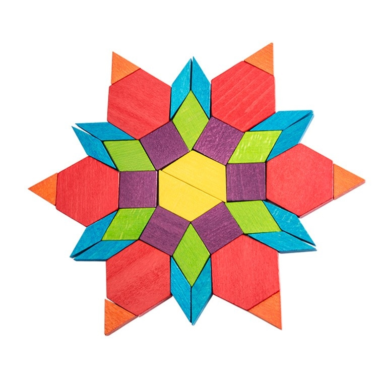

# Puzzle_Game
This game is a puzzle game where the player has to solve all the puzzles to unlock every continent on the globe.
At every puzzle there are different blocks and shapes lying around and the finished pattern appears one second. There is a 1 minute timer at each "level"
and the patterns get more and more complex. When you don't get the pattern right in time you have to start over again.

### Puzzle
A pattern that is made up of different geometrical shapes shows up on a wall 1 second so the player can remember it. after that 1 second
a 1 minute timer goes of and the player has to rebuild the pattern on the floor with the parts lying around. If the player is able to rebuild the
exact pattern in 1 minute or under, a door opens up. If not, the blocks reset to the start position and the player needs to try again.

Pattern example:

### Versions
* Unity 2019.1.14f1
* SteamVR 2.5.0

### Scribbles 

